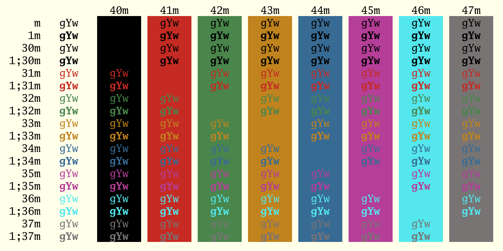

# 1981 iTerm Color Scheme

This is a theme for iTerm2 based on [ACME](http://acme.cat-v.org/) and memories of some of the first computers I used. 
 
It's also an effort to help maintain my eyesight. See [Hi Dark Themers, by Eliot Miranda ](https://marc.info/?l=squeak-dev&m=152276165310052&w=2).

## Usage

1. Clone this repo or [download the `1981.itermcolors. `]https://raw.githubusercontent.com/michaelbiven/1981-itermcolors/master/1981.itermcolors)
1. `iTerm2 > Preferences > Profiles > Colors Tab`
2. Select `Color Presets`
3. Select `Import`
4. Select the `1981.itermcolors` file
5. Select `1981` from `Color Presets`
